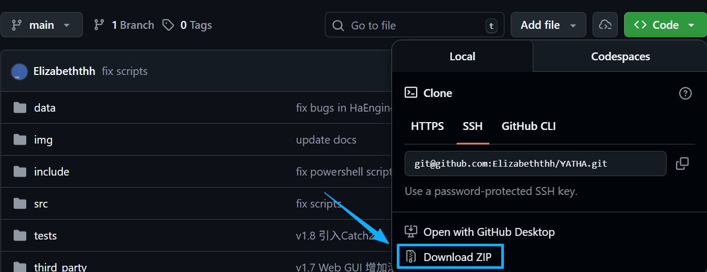
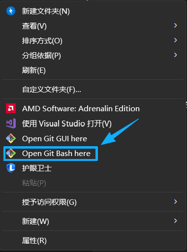
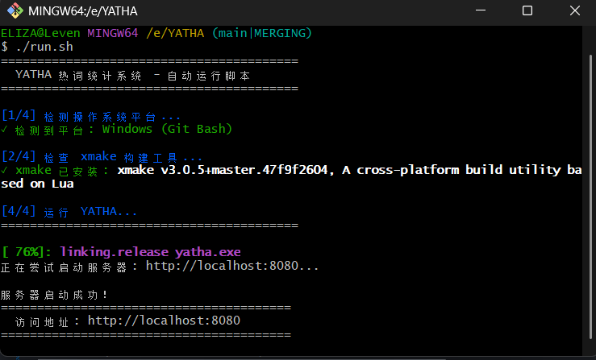

# YATHA(Yet Another Tiny Hotwords Analyzer) 热词统计系统
## 项目介绍

**YATHA** 是一个高性能的实时热词分析系统，基于滑动时间窗口机制，能够从大量文本数据中快速提取和分析热门词汇，可以为弹幕分析、社交媒体监测、舆情分析等场景提供强大的技术支持。本项目提供 Web GUI 界面，支持直接分析和滚动分析两种模式。滚动分析模式下可以实时绘制热词柱状图和词云图提供热词的直观展示。

本项目是数据结构与算法课程大作业的实现，仅供学习交流使用。

### 核心特性

- **滑动时间窗口**：采用高效的时间窗口算法，实时追踪指定时间段内的词频变化
- **智能分词**：基于 cppjieba 分词库，支持中文分词、词性标注和自定义词典
- **词性过滤**：提供灵活的词性过滤和放行机制，可按需筛选名词、动词、形容词等特定词性的热词
- **TopK 排行**：高效的词频统计和排序算法，快速获取指定数量的高频词汇
- **Web GUI**：提供简洁流畅的 Web 界面，支持文本上传、直接分析、滚动饭呢西和可视化展示
- **高性能**：采用模块化设计，时间窗口管理器、词频排名管理器各司其职，性能优异
- **跨平台支持**：基于 Xmake 构建系统，支持 Linux、macOS、Windows 等多平台编译运行
- **测试保障**：集成 Catch2 测试框架，确保代码质量和稳定性

### 技术架构

- **分词引擎**：[cppjieba](https://github.com/yanyiwu/cppjieba)，支持多种分词模式和词性标注
- **Web 服务**：使用 [cpp-httplib](https://github.com/yhirose/cpp-httplib)，一个轻量级的 HTTP 服务器
- **数据处理**：JSON 数据的解析使用了 [nlohmann/json](https://github.com/nlohmann/json) 库
- **构建工具**：选用 [Xmake](https://github.com/xmake-io/xmake) 作为跨平台构建工具
- **测试框架**：[Catch2](https://github.com/catchorg/Catch2)

---
## 版本迭代记录
### v0.1 完成基础滑动窗口热词统计功能
### v0.2 引入 Xmake 支持跨平台编译
### v0.3 实现词性过滤/放行功能
### v0.7 实现 Web GUI 界面
### v0.8 代码重构
### v1.0 将词性过滤/放行功能整合到 Web GUI 中
### v1.1 引入 nlohmann/json 库处理 JSON 数据
### v1.7 在 Web GUI 界面 增加滚动查询功能
### v1.8 引入 Catch2 测试框架。
### v2.0（正式）修复漏洞，提供运行脚本。
---

## 快速开始

### 克隆项目仓库

#### Linux
```shell
sudo apt update && sudo apt install git -y
git clone https://github.com/Elizabeththh/YATHA.git
cd YATHA
./run.sh
```
如果提示没有执行权限，
```shell
sudo chmod +x run.sh
./run.sh
```

#### MacOS
```shell
# 如果没有安装 Homebrew 包管理器，先安装：
/bin/bash -c "$(curl -fsSL https://raw.githubusercontent.com/Homebrew/install/HEAD/install.sh)"
brew install git
git clone https://github.com/Elizabeththh/YATHA.git
cd YATHA
bash ./run.sh
```

#### Windows
先在官网下载 Git 安装包：[官网下载地址](https://github.com/git-for-windows/git/releases/download/v2.52.0.windows.1/Git-2.52.0-64-bit.exe)

下载仓库源码：


在文件资源管理器中打开项目文件夹，右键空白区域



在打开的 Git Bash 中输入
```shell
./run.sh
```



打开 Git Bash 中提示的 URL 即可

--- 
## 运行单元测试

现有的单元测试有：
- test_word_ranker (测试 `WordRanker` 类的成员函数，即检测 TopK 功能的正确性)
- test_stop_words_manager (测试 `StopWordsManager` 类的成员函数，即过滤停用词功能的正确性)
- test_time_window_manager (测试 `TimeWindowManager` 类的成员函数，即时间窗口功能的正确性)
- test_ha_engine_sse (测试 `HaEngineSSE` 类的成员函数，即 Web GUI 的滚动分析功能的正确性)

如果要运行单元测试，首先将`xmake.lua`的这一行取消注释
```lua
-- add_requires("catch2 3.x")   
```
然后运行：
```shell
xmake run <单元测试名>
```
单元测试名即上面列出的名字。下载链接 Catch2 库需要一段时间，请耐心等待

如果想要添加新的测例，请在 tests 目录下找到对应的测试文件，仿照已有测试代码添加即可

